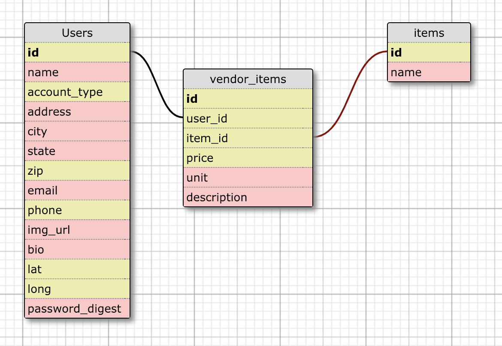
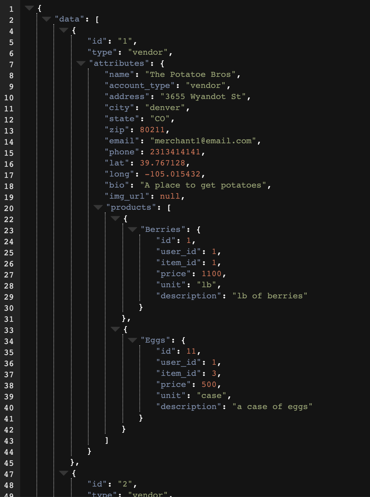
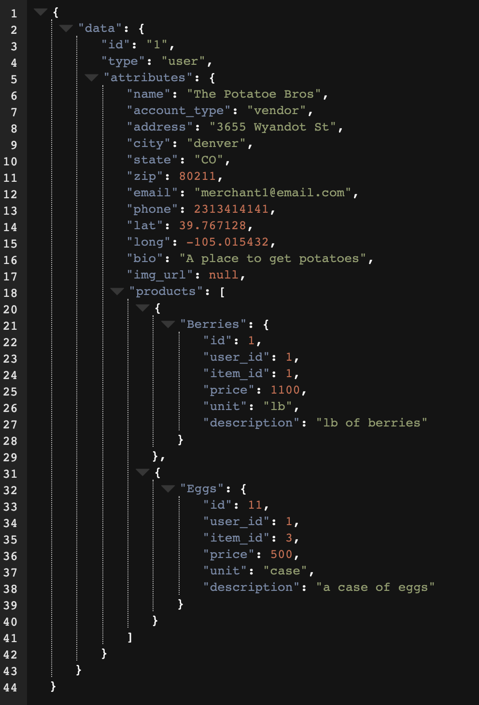
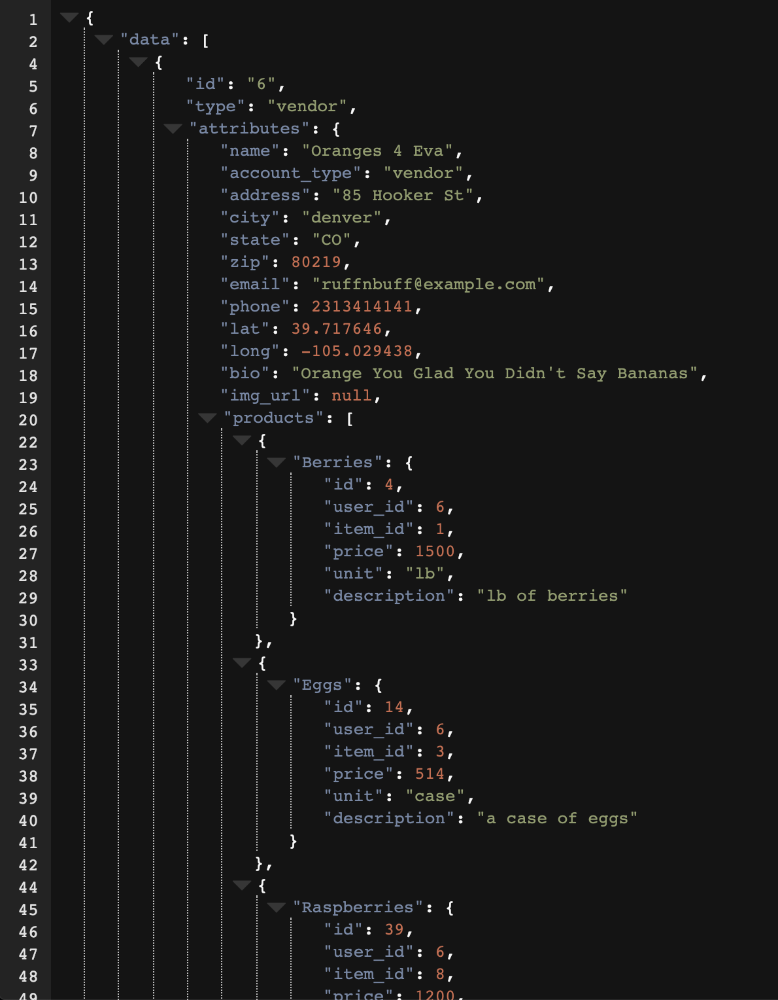
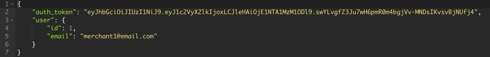
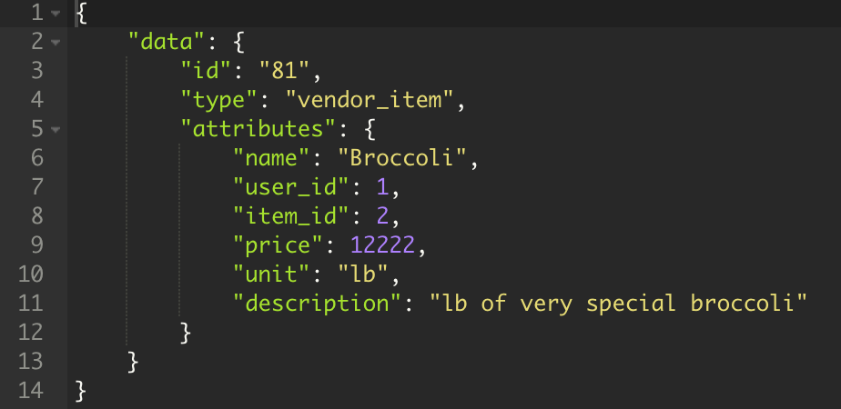
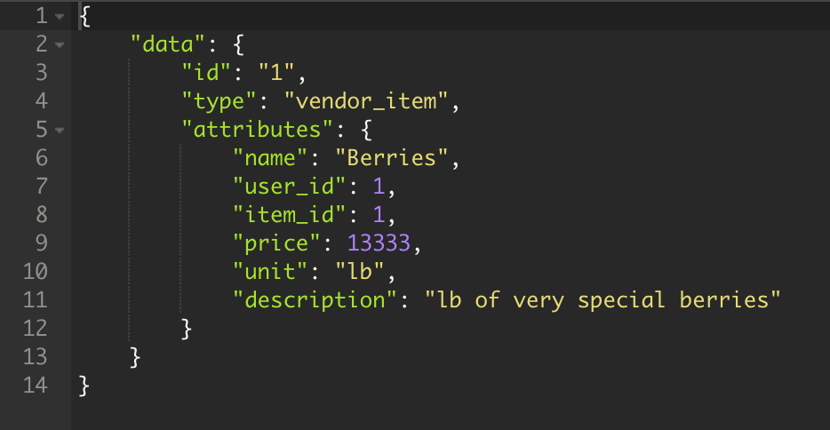
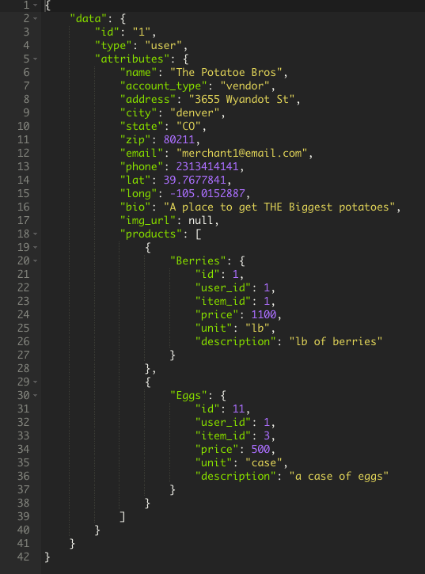

# *CrossPoll BE* - ReadMe

### Introduction

CrossPoll BE is a back-end API, built with Ruby on Rails, that provides endpoints for the front-end app, **_From the Farm_**, found at https://github.com/lorynmason/from-the-farm and deployed at https://from-the-farm.herokuapp.com/buy. CrossPoll BE utilizes the GeoKit-Rails gem and plugin to geocode incoming addresses, through the Google GeoCoding API, and to run geographically-based queries on a PostgresQL database. It uses JSON Web Tokens for user authentication. Successful requests return data in FastJSON API formatted responses.
This project was built by Melvin Cedeno (GitHub: TheCraftedGem) and Dan Hutchinson (GitHub: DanHutch) as the back-end component for a final cross-pollination project for module 4 of the Back-End Engineering program at the Turing School. It was built in conjunction with front a front-end team of Loryn Mason (GitHub: ) and Mike Duke (GitHub: ).

This project was built using Rails v5.2.2,  Ruby v2.4.1, and PostgresQL v11.1 and comes with all the necessary gems in the Gemfile. After forking and cloning the repo, simply run `bundle` from the command line.

### Setup:

First, clone this repo:

```
git clone git@github.com:DanHutch/crosspoll_be.git
```
Then, run `bundle` from the command line, from within the project directory. Then, you can create the database and schema using `bundle exec rake db:{create,migrate}`.

If done properly, you should now be able to run the local test suite using the command `bundle exec rspec`.

*This app requires an API key for the Google GeoCoding API in order to function. In the development of Sweater Weather, `gem 'figaro'` was used to hide secrets, such as this API key, in testing and development, and is recommended for this purpose.*

### Gems:

- rails
- pg
- puma
- fast_jsonapi
- figaro
- faraday
- rack-cors
- travis
- geokit-rails
- bcrypt
- jwt
- bootsnap
- byebug
- rspec-rails
- shoulda-matchers
- fuubar
- simplecov
- pry
- database_cleaner
- webmock
- vcr
- capybara
- listen
- tzinfo-data

### Schema:



### API Endpoints:

#### _Public Endpoints_

**1. Vendor Index**
   - Method: `GET`
   - URI: `/api/v1/vendors`
   - This endpoint returns a complete list of vendors (user entries with an `account_type` attribute of `vendor`, the `0` enum), along with nested entries for all vendor_items that belong to each.
   - Sample request:
     ```
     GET /api/v1/vendors
     Content-Type: application/json
     Accept: application/json
     ```
   - Sample response body (abridged): `status: 200`



**2. User Show**
   - Method: `GET`
   - URI: `/api/v1/users/:id`
   - This endpoint displays user-specific information for the user with the `id` attribute specified in the `:id` of the request URL.
   - Sample request:
     ```
     GET /api/v1/users/1
     Content-Type: application/json
     Accept: application/json
     ```
   - Sample response body: `status: 200`

     

**3. Search**
   - Method: `GET`
   - URI: `/api/v1/search`
   - This endpoint takes 2 query parameters of `loc` and `range`, with an optional parameter of `item`. With only the 2 required parameters present, it returns a list of all vendors within the given search `range` (in which `range` is a number of miles) of the specified location (`loc`). When the optional `item` parameter is present (and is a valid `item_id`), it narrows the same results to only those vendors who have a vendor_item with the specieid `item_id`. In either case, the `loc` value can be any input able to be geocoded be the Google GeoCoding API. Query parameters may also be sent in the body of the request, in JSON format.
   - Sample request:
     ```
     GET /api/v1/search
     Content-Type: application/json
     Accept: application/json

     {
      "loc": "80204",
      "range": 5,
      "item": 1
     }
     ```
   - Sample response body (abridged): `status: 200`


     

**4. Registration**
   - Method: `POST`
   - URI: `/api/v1/registration`
   - This endpoint takes in new User registration data and, if successful, returns a JSON Web Token for the newly created user. All attributes except for the optional `"img_url"` must be present and `"password"` must match `"password_confirmation"` in order for a request to be successful. If an email already in use, in the database, is found in the `"email"` attribute, the request will not be successful.
   - Sample request:
     ```
     POST /api/v1/registration
     Content-Type: application/json
     Accept: application/json

    {
      "name": "The Potatoe Bros",
      "account_type": "vendor",
      "address": "3655 Wyandot St",
      "city": "denver",
      "state": "CO",
      "phone": 2313414141,
      "zip": 80211,
      "email": "merchant100@email.com",
      "bio": "A place to get potatoes",
      "password": "user_1",
      "password_confirmation": "user_1"
    }
     ```
   - Sample response body: `status: 201`


     

#### _Authenticated Endpoints_
The Authentication endpoint responds to successful POST requests by sending back a JSON Web Token. This JWT must be included in the `Authorization` header of requests to all other authenticated endpoints.

**5. Authentication**
   - Method: `POST`
   - URI: `/api/v1/authentication`
   - This endpoint allows user login (creation of a JSON Web Token) by sending a valid user `email:` and `password:` in the body of a `post` request. If successful, it sends back a JSON Web Token in the `"auth_token"` key of the response body, along with the user's `id` and `email`.
   - Sample request:
     ```
     POST /api/v1/authentication
     Content-Type: application/json
     Accept: application/json

     {
      "email": "merchant1@email.com",
      "password": "user_1"
     }
     ```
   - Sample response body: `status: 200`

     

**6. Adding a Vendor_Item**
   - Method: `POST`
   - URI: `/api/v1/vendor_items`
   - This endpoint allows an authenticated user to create a new vendor_item. It creates a new vendor_item from the `item_id` specified in the JSON body of the request, along with the user's ID included in the JWT in the Authorization header of the request.
   - Sample request:
     ```
     POST /api/v1/vendor_items
     Content-Type: application/json
     Accept: application/json
     Authorization: "Bearer <JSON Web Token>"

     {
      "item_id": 2,
      "price": 12222,
      "unit": "lb",
      "description": "lb of very special broccoli"
     }
     ```
   - Sample response body: `status: 201`

     

**7. Updating a Vendor_Item**
   - Method: `PUT`
   - URI: `/api/v1/vendor_items/:vendor_item_id`
   - This endpoint allows an authenticated user to update one of their existing vendor_items. It updates the vendor_item with the `:vendor_item_id` specified in the URL. The JSON-formatted request body _must_ contain values for _all_ of the require attributes for a vendor_item, in order for the request to be successful.
   - Sample request:
     ```
     PUT /api/v1/vendor_items/1
     Content-Type: application/json
     Accept: application/json
     Authorization: "Bearer <JSON Web Token>"

     {
      "price": 13333,
      "unit": "lb",
      "description": "lb of very special berries"
     }
     ```
   - Sample response body: `status: 200`

     


**8. Updating a User**
   - Method: `PUT`
   - URI: `/api/v1/edit_profile`
   - This endpoint allows an authenticated user to update their information. It updates the current user as  specified by the user id in the JSON Web Token. The JSON-formatted request body _must_ contain values for _all_ of the require attributes for a user, including `"password:"` and matching `"password_confirmation:"` in order for the request to be successful.
   - Sample request:
     ```
     PUT /api/v1/edit_profile
     Content-Type: application/json
     Accept: application/json
     Authorization: "Bearer <JSON Web Token>"
    
    ```
    {      
      name: "The Potatoe Bros",
      account_type: 'vendor',
      address: "3655 Wyandot St",
      city: "denver",
      state: "CO",
      phone: 2313414141,
      zip: 80211,
      email: "merchant1@email.com",
      bio: "A place to get THE Biggest potatoes",
      password: "user_1",
      password_confirmation: "user_1"
    }
    ```
   - Sample response body: `status: 200`

     

### Contributing:

In order to contribute, please fork this repo, then clone your new repo and create a branch for your feature.

Please make sure to test your feature fully, using RSpec, before commiting your changes and pushing to your own repo, then create and submit a pull request back to this repository.

Please contact Dan Hutchinson (DanHutch) or Melvin Cedeno (TheCraftedGem) via GitHub, if you have any questions, etc.
